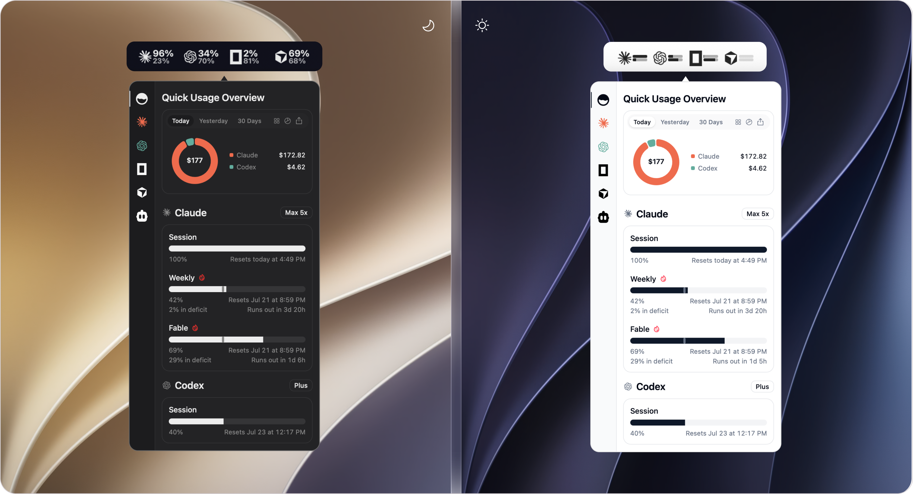
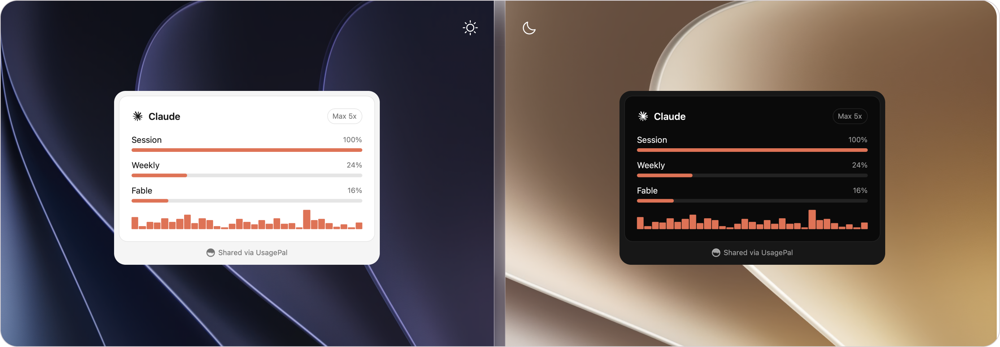

<p align="center">
  
</p>

<h1 align="center">UsagePal</h1>

<p align="center"><strong>Track all your AI coding subscriptions in one place.</strong></p>

[](https://keylight.dev)
[](https://buymeacoffee.com/dmzxnico)

See your usage at a glance from your menu bar. No digging through dashboards.

<div align="center">
  
  <br />
  
</div>

## Download

[**Download the latest release**](https://github.com/Halloweedev/usagepal/releases/latest)

- **macOS:** signed DMG for Apple Silicon and Intel
- **Linux:** `.deb` (Debian/Ubuntu), `.rpm` (Fedora), and AppImage

The app auto-updates from GitHub Releases (`latest.json`, including `linux-x86_64` once a Linux build is in that release). Install once and you're set. If you want early builds, turn on **Get Beta Updates** in Settings and beta updates will appear in the normal in-app update button.

## What It Does

UsagePal lives in your menu bar and shows you how much of your AI coding subscriptions you've used. Progress bars, badges, and clear labels. No mental math required.

- **One glance.** All your AI tools, one panel.
- **Always up-to-date.** Refreshes automatically on a schedule you pick.
- **[Pace alerts](docs/notifications.md).** Optional notifications when a limit is on track to run out.
- **Global shortcut.** Toggle the panel from anywhere with a customizable keyboard shortcut.
- **Lightweight.** Opens instantly, stays out of your way.
- **Plugin-based.** New providers get added without updating the whole app.
- **[Local HTTP API](docs/local-http-api.md).** Other apps can read your usage data from `127.0.0.1:6736`.
- **[Proxy support](docs/proxy.md).** Route provider HTTP requests through a SOCKS5 or HTTP proxy.

## Supported Providers

- [**Amp**](docs/providers/amp.md) / subscription usage, daily free usage, credits
- [**Antigravity**](docs/providers/antigravity.md) / all models
- [**Claude**](docs/providers/claude.md) / session, weekly, extra usage, local token usage (ccusage)
- [**ClinePass**](docs/providers/cline-pass.md) / Session, weekly, monthly limits, balance, usage trend
- [**Codex**](docs/providers/codex.md) / session, weekly, reviews, credits
- [**Copilot**](docs/providers/copilot.md) / credits, extra usage, chat, completions
- [**Cursor**](docs/providers/cursor.md) / credits, total usage, auto usage, API usage, on-demand (macOS, Linux, Windows Desktop sign-in)
- [**Factory / Droid**](docs/providers/factory.md) / standard, premium tokens
- [**Grok**](docs/providers/grok.md) / credits used, plan, pay-as-you-go cap
- [**JetBrains AI Assistant**](docs/providers/jetbrains-ai-assistant.md) / quota, remaining
- [**Kiro**](docs/providers/kiro.md) / credits, bonus credits, overages
- [**Kimi Code**](docs/providers/kimi.md) / session, weekly
- [**MiniMax**](docs/providers/minimax.md) / coding plan session
- [**OpenCode Go**](docs/providers/opencode-go.md) / 5h, weekly, monthly spend limits
- [**OpenRouter**](docs/providers/openrouter.md) / credits, balance, daily/weekly/monthly spend, key limit
- [**Devin**](docs/providers/devin.md) / weekly quota, daily quota, ACU, extra usage, on-demand credits
- [**Z.ai**](docs/providers/zai.md) / session, weekly, web searches

Community contributions welcome. Want a provider that's not listed? [Open an issue.](https://github.com/Halloweedev/usagepal/issues/new)

## Open Source, Community Driven

UsagePal is open source and grows through community contributions: new providers, bug fixes, and ideas. If something is missing or broken, the best way to get it fixed is to [open an issue](https://github.com/Halloweedev/usagepal/issues/new) or submit a PR.

Plugins are currently bundled; making them loadable so you can build and run your own is on the roadmap.

### How to Contribute

- **Add a provider.** Each one is just a plugin. See the [Plugin API](docs/plugins/api.md).
- **Fix a bug.** PRs welcome. Provide before/after screenshots.
- **Request a feature.** [Open an issue](https://github.com/Halloweedev/usagepal/issues/new) and make your case.

Keep it simple. No feature creep, test your changes.

## Support UsagePal

UsagePal is free and stays free. If it saves you a trip to a dashboard, you can [**buy me a coffee**](https://buymeacoffee.com/dmzxnico) — it covers the Apple Developer account, code signing, and the time that goes into new providers.

You can also support it for free: star the repo, report bugs, or add a provider.

## Credits

- UsagePal is built on [**OpenUsage**](https://github.com/robinebers/openusage) by [Robin Ebers](https://github.com/robinebers). If you want a native macOS app, try OpenUsage instead.
- Inspired by [CodexBar](https://github.com/steipete/CodexBar) by [@steipete](https://github.com/steipete).

Maintained by [Nicolas Demanez](https://github.com/Halloweedev).

## License

[MIT](LICENSE). See [NOTICE](NOTICE) for attribution.

## Privacy

UsagePal sends an anonymous usage signal to [Keylight](https://keylight.dev) at
most once per day to count active installs. It contains no personal data and is
not tied to your identity — only a randomly generated install id, the app and
SDK versions, and your platform (e.g. macOS). Licensing for supporters is also
handled by Keylight, with license keys verified offline on your device.

---

<details>
<summary><strong>Build from source</strong></summary>

> **Warning**: The `main` branch may not be stable. Use tagged versions for stable builds.

### Stack

- TypeScript + React + Vite + Tailwind (frontend)
- Rust + Tauri v2 (backend)
- QuickJS (`rquickjs`) for the plugin engine
- [lutin](https://github.com/Halloweedev/lutin) for macOS DMG packaging, signing, and notarization

On Linux, `tauri.linux.conf.json` builds `.deb`, `.rpm`, and AppImage. Fedora needs WebKitGTK and appindicator devel packages (for example `webkit2gtk4.1-devel` and `libappindicator-gtk3-devel`). Linux builds are not Apple-signed; updater signatures still use the existing Tauri key in CI. If AppImage bundling fails on strip or FUSE, set `NO_STRIP=1` and `APPIMAGE_EXTRACT_AND_RUN=1`.

```bash
bun install
bun run tauri dev      # run in development
bun run tauri build    # production build
```

</details>
